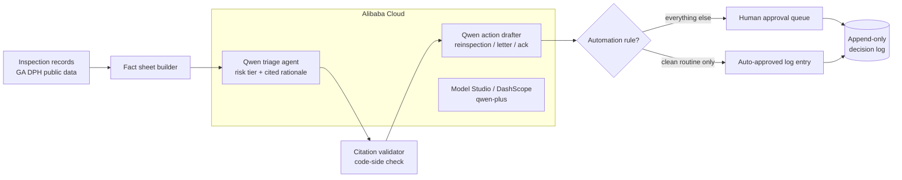

# Inspection Autopilot

An autopilot agent for county food-safety operations, built on Qwen (Alibaba Cloud Model Studio). It reads real restaurant inspection results, triages follow-up risk with cited reasoning, drafts the concrete next actions (re-inspection scheduling, follow-up letters), and routes every consequential step through a human approval queue. Only one narrow, explicitly listed automation rule may skip the queue.

Track 4 (Autopilot Agent), Global AI Hackathon Series with Qwen Cloud.

## Why this workflow

Environmental health offices are chronically understaffed. Inspection results pile up, and the follow-up work (deciding who needs a recheck, drafting violation letters, reordering the queue) is exactly the repetitive, judgment-adjacent work an agent should draft and a human should approve. The demo runs on real public inspection data from Clayton County, Georgia (309 facilities, 1,333 inspections, 3,579 violation records from the GA DPH public portal).

## What "governed autonomy" means here

- **The agent proposes, a person disposes.** Every re-inspection and every letter sits in an approval queue until a supervisor approves or rejects it.
- **Citations are verified in code.** Every risk rationale must cite violation items that actually appear in the inspection record. Citations that do not match are dropped and counted, so the hallucination rate is measured, not assumed (see `evals/`).
- **The action log is append-only.** Proposals and decisions are insert-only tables; a decision is final and the source inspection data is never mutated.
- **Automation is explicit.** Exactly one rule may bypass the queue (acknowledging a clean, high-scoring routine inspection), and the UI lists it.

## Architecture



Backend: FastAPI, deployed on Alibaba Cloud. Model calls: Qwen via the Model Studio OpenAI-compatible endpoint (`app/qwen.py` is the deployment-proof code file). Store: SQLite, insert-only. UI: a single dependency-free page.

## Run it

```bash
pip install -r requirements.txt
cp .env.example .env            # add your DASHSCOPE_API_KEY to go live
uvicorn app.main:app --port 8080
# open http://localhost:8080
```

Without a key the app runs in a clearly labeled stub mode (deterministic heuristic with the same JSON contract) so the approval workflow can be exercised offline. All demo footage uses live mode.

## Evals and tests

```bash
pytest                          # store, rules, citation validation, stub pipeline
python -m evals.eval_triage --n 25
```

The eval reports the tier distribution, the measured citation hallucination rate, and two hard invariants: no dangerous inspection (uncorrected priority violation, score under 85) may be triaged ROUTINE, and drafted actions must match the assigned tier.

## Data

`data/*.jsonl` is public inspection data for Clayton County, GA, collected from the Georgia Department of Public Health public inspection portal. Scores, violation items, priority designations, and correction status are as published.

## License

MIT
