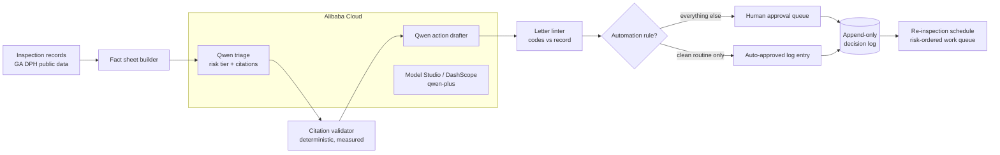

# Inspection Autopilot

An autopilot agent for county food-safety operations, built on Qwen (Alibaba Cloud Model Studio). It reads real restaurant inspection results, triages follow-up risk with citations verified in code, drafts the concrete next actions (re-inspection scheduling, follow-up letters), and routes every consequential step through a human approval queue. Approved re-inspections roll up into a dated, risk-ordered inspector schedule. Exactly one narrow, explicitly listed automation rule may skip the queue.

Track 4 (Autopilot Agent), Global AI Hackathon Series with Qwen Cloud.

**Live demo (Alibaba Cloud Singapore, live qwen-plus): http://47.82.181.199:8080** - click "Run agent" yourself; the approval queue, schedule, and trust metrics are all real.

## The receipts: the future agreed with the triage

We replayed Clayton County's own history to test whether the agent's judgment holds up. For 350 real (inspection, next inspection) pairs, live qwen-plus triaged each inspection using only information available at that time, and we then checked what actually happened at that facility's next real inspection:

| Agent tier at time T | n | Failed their next real inspection |
|---|---|---|
| URGENT | 37 | **67.6%** |
| ELEVATED | 223 | 56.5% |
| ROUTINE | 90 | **21.1%** |
| (base rate, all pairs) | 350 | 48.6% |

"Failed" means the next inspection scored under 85 or recorded a priority violation. The construction is leakage-free: the fact sheet contains only time-T data. This is a validity check of the tiers (are they worth acting on?), not a forecasting benchmark. Full method and cached results: `evals/backtest_outcomes.py`, `evals/backtest_results.json`, served live at `/api/outcomes`.

## Why this workflow

Environmental health offices are chronically understaffed. Inspection results pile up, and the follow-up work (deciding who needs a recheck, drafting violation letters, ordering the queue) is exactly the repetitive, judgment-adjacent work an agent should draft and a human should approve. The demo runs on real public inspection data from Clayton County, Georgia: 309 facilities, 1,333 inspections, 3,579 violation records from the GA DPH public portal.

## What "governed autonomy" means here

- **The agent proposes, a person disposes.** Every re-inspection and every letter sits in an approval queue until a supervisor approves or rejects it. Decisions are final and append-only.
- **Citations are verified in code.** Every triage rationale must cite violation lines copied verbatim from the record (whole line or a substantial 20+ character fragment). Non-matching citations are dropped and counted, so the hallucination rate is measured, not assumed.
- **Letters are machine-cross-checked.** A deterministic linter verifies every violation code a drafted letter names against the official record and badges any mismatch right above the Approve button.
- **Every card shows its evidence.** The exact fact sheet the agent read is one click away on each proposal, so a supervisor (or a judge) can check any citation against the source.
- **Automation is explicit.** Exactly one rule may bypass the queue (acknowledging a clean, high-scoring routine inspection), and the UI lists it.
- **The system measures itself on screen.** The live trust strip shows agent-human agreement rate, citations dropped by the validator, and tier mix, straight from the append-only log.

## Measured, not assumed

Committed live-mode reports in `evals/results/`:

**Grounding** (`live-qwen-plus-n50.json`): 50 inspections including 28 stratified dangerous cases (uncorrected priority violation, score under 85). Citation hallucination rate **0.0% across 126 citations**. Zero dangerous inspections triaged ROUTINE. Zero tier/action inconsistencies. Live-vs-heuristic tier confusion matrix included; disagreements skew conservative (the model escalates cases the heuristic would let pass, never the reverse).

**Fault injection** (`sabotage-25.json`): a zero hallucination rate is only meaningful if the alarm actually rings, so we forged 50 citations ourselves, half invented outright, half real violation text lifted from *different* inspections (the harder case). The validator caught **50 of 50** and preserved **75 of 75** legitimate citations.

Scope, stated honestly: the 0% rate covers triage citations, which code validates directly. Letter bodies are free text and are covered by the deterministic code linter plus the human approval gate, not by the citation metric. In stub mode (no API key) the eval invariants hold by construction; only live-mode numbers are quoted here.

```bash
pytest                                        # 20 tests incl. HTTP-level suite
python -m evals.eval_triage --n 25 --dangerous 25   # grounding + safety invariants
python -m evals.eval_triage --sabotage 25           # fault-inject the validator
python -m evals.backtest_outcomes --sample 350      # outcome backtest (live only)
```

## Architecture



Backend: FastAPI on Alibaba Cloud (`app/qwen.py` is the deployment-proof code file: Qwen via the Model Studio OpenAI-compatible endpoint). Store: SQLite, insert-only tables for proposals and decisions. UI: one dependency-free page. Built to survive an unattended public deployment: bounded model timeouts, per-inspection error isolation with a circuit breaker, a single-flight run lock, a daily run budget, and input validation on every write path.

## Run it

```bash
pip install -r requirements.txt
cp .env.example .env            # add your DASHSCOPE_API_KEY to go live
uvicorn app.main:app --port 8080
# open http://localhost:8080
```

Or with Docker:

```bash
docker build -t inspection-autopilot .
docker run -p 8080:8080 -e DASHSCOPE_API_KEY=sk-... inspection-autopilot
```

Without a key the app runs in a clearly labeled stub mode (deterministic heuristic, same JSON contract) so the workflow can be exercised offline. All quoted numbers and demo footage are live mode.

### Configuration

| Variable | Default | Meaning |
|---|---|---|
| `DASHSCOPE_API_KEY` | (empty) | Model Studio key; empty = stub mode |
| `QWEN_BASE_URL` | dashscope-intl compatible-mode | OpenAI-compatible endpoint |
| `QWEN_MODEL` | `qwen-plus` | Any Qwen chat model |
| `MAX_RUNS_PER_DAY` | 50 | Public-demo budget guard |

### API

| Method | Path | Description |
|---|---|---|
| POST | `/api/run?batch=5` | Triage the next unprocessed inspections (single-flight, budgeted) |
| GET | `/api/proposals?status=proposed` | Approval queue / full action log |
| POST | `/api/proposals/{id}/decide` | Record a final human decision |
| GET | `/api/inspections/{id}/record` | The exact fact sheet the agent read |
| GET | `/api/schedule` | Approved re-inspections as a dated work queue |
| GET | `/api/outcomes` | Cached outcome backtest |
| GET | `/api/stats` | Trust-strip metrics from the append-only log |
| GET | `/api/health` | Mode, model, dataset size |

## Data

`data/*.jsonl` is public inspection data for Clayton County, GA, collected from the Georgia Department of Public Health public inspection portal. Scores, violation items, priority designations, and correction status are as published.

## License

MIT
